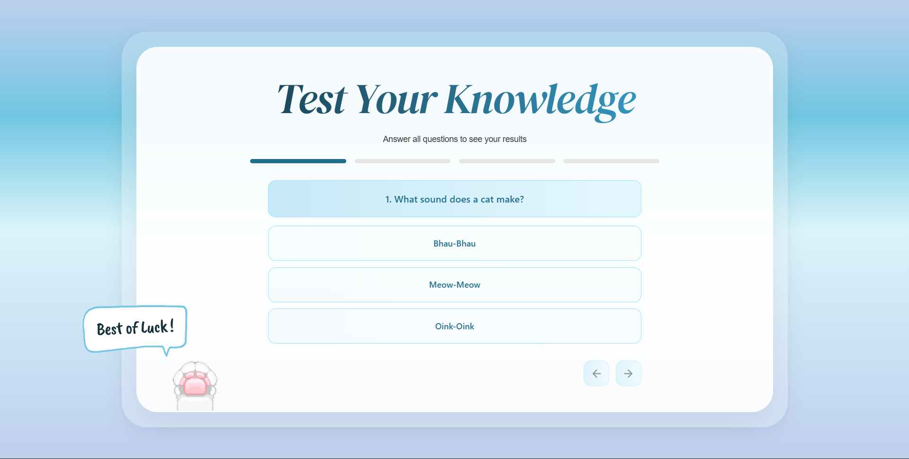

# Quiz Application



## Project Overview

A modern, interactive quiz application built with [Next.js](https://nextjs.org) and [React](https://react.dev). This frontend project features a responsive quiz interface with smooth animations, real-time score tracking, and a polished user experience using the Shadcn UI component library.

## Features

- **Interactive Quiz**: Engaging multiple-choice quiz with smooth animations
- **Real-time Score Tracking**: Track your progress as you answer questions
- **Responsive Design**: Mobile-friendly interface that works on all devices
- **Modern UI Components**: Built with Shadcn UI and Radix UI primitives
- **Smooth Animations**: Framer Motion animations for enhanced user experience
- **Dark Mode Support**: Next Themes integration for light/dark mode toggle

## Tech Stack

- **Framework**: [Next.js](https://nextjs.org) 15.5.7
- **UI Library**: [React](https://react.dev) 19.2.0
- **Component Library**: [Shadcn UI](https://ui.shadcn.com/)
- **Styling**: Tailwind CSS
- **Animation**: [Framer Motion](https://www.framer.com/motion/)
- **Form Handling**: React Hook Form
- **Icons**: Lucide React
- **Theme**: Next Themes

## Getting Started

### Prerequisites
- Node.js 16+ or Bun runtime

### Installation

1. Clone the repository
2. Install dependencies:

```bash
npm install
# or
bun install
```

### Development Server

Run the development server:

```bash
npm run dev
# or
bun dev
```

Open [http://localhost:3000](http://localhost:3000) in your browser to see the application.

## Available Scripts

- `bun dev` - Start development server with Turbopack
- `bun build` - Build for production
- `npm start` - Start production server
- `npm run lint` - Run ESLint

## Project Structure

```
src/
├── app/
│   ├── layout.tsx      # Root layout
│   ├── page.tsx        # Quiz component
│   └── globals.css     # Global styles
├── components/
│   └── ui/             # Shadcn UI components
└── hooks/              # Custom React hooks
```

## Key Components

The main quiz application is built with:
- **Framer Motion**: For smooth page transitions and animations
- **React State Management**: For tracking quiz progress and scores
- **Responsive Layouts**: Mobile-first design approach
